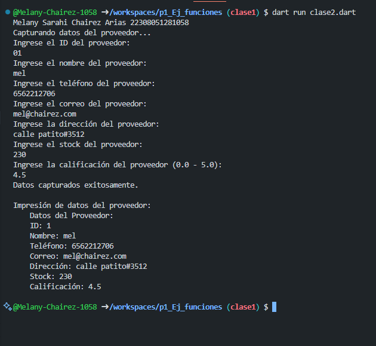
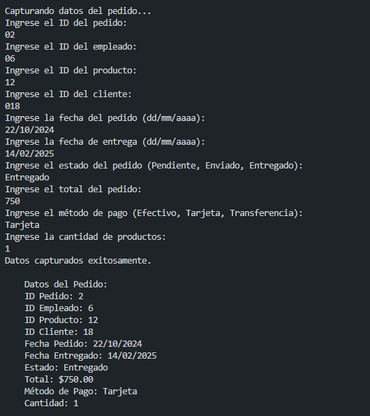
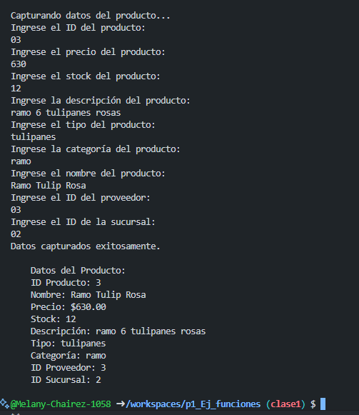

* crear una clase proveedor con  atributos (id_proveedor, nombre_pro, telefono, correo, Direccion, Stock y calificacion), una funcion captura() y otra mostrar datos(), crear la instancia y utilizar los atributos y llamadas a funciones. lenguaje dart
* Salida
* 
* crear una clase pedido con  atributos (id_pedido, id_empleado, id_producto, id_cliente, fecha_pedido, fecha_entregado, estado , total, metodo_pago y cantidad), una funcion captura de datos por el usuario() y otra mostrar datos(), crear la instancia y utilizar los atributos y llamadas a funciones. lenguaje dart
* Salida
* 
* crear una clase productos con  atributos (id_prod, precio, stock, descripcion, tipo, categoria, nombre, id_proveedor y id_sucursal), una funcion captura de datos por el usuario() y otra mostrar datos(), crear la instancia y utilizar los atributos y llamadas a funciones. lenguaje dart
* Salida
* 