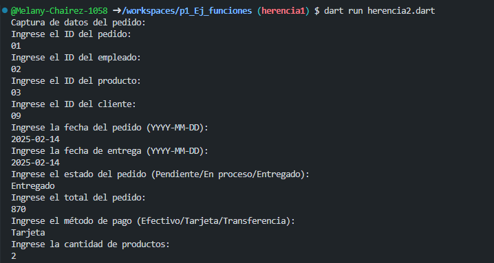
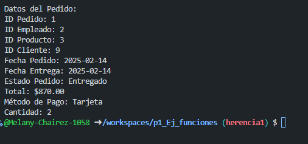
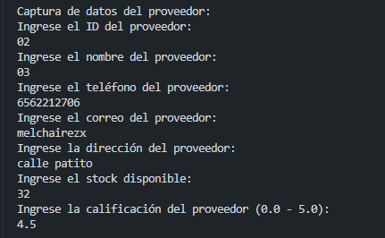
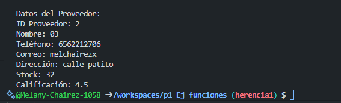

# PEDIDO
* crear la clase pedido con los atributos (id_pedido,id_empleado, id_producto,id_cliente, fecha_pedido,fecha_entrega, estado_pedido, total,meodo_pago y cantidad) con una funcion capturadatos(), con interaccion de interfaz de usuario. crear la clase Datospedido con herencia pedidoy una funcion MostrarDatos(). lenguaje dart
* Salida:
* Captura:
* 
* Datos:
* 
# PROVEEDOR
* crear la clase proveedorcon los atributos (id_proveedor,nombre, telefono,correo, direccion,stock, calificacion, ) con una funcion capturadatos(), con interaccion de interfaz de usuario. crear la clase DatosProveedorcon herencia proveedory una funcion MostrarDatos(). lenguaje dart
* Salida:
* Captura:
* 
* Datos:
* 