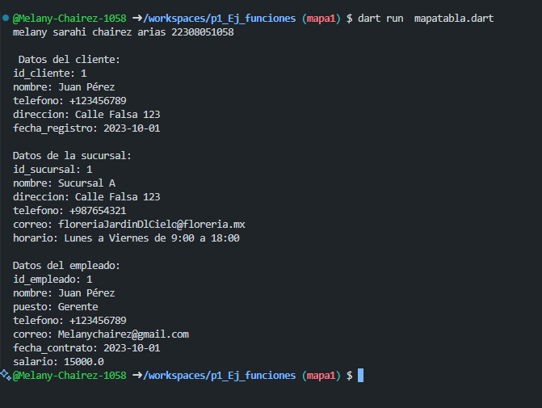

* crear map <string, dynamic> cliente con los siguientes key, id_cliente,nombre,telefono,direccion y fecha_registro. y mostrar los datos con un for each en lenguaje dart
* crear map <string, dynamic> sucursal con los siguientes key, id_sucursal,nombre,telefono,direccion y horario y coreo. y mostrar los datos con un for each en lenguaje dart
* crear map <string, dynamic> empleado con los siguientes key, id_empleado,nombre,puesto,telefono,correo,salario y fecha_contrato. y mostrar los datos con un for each en lenguaje dart
* 